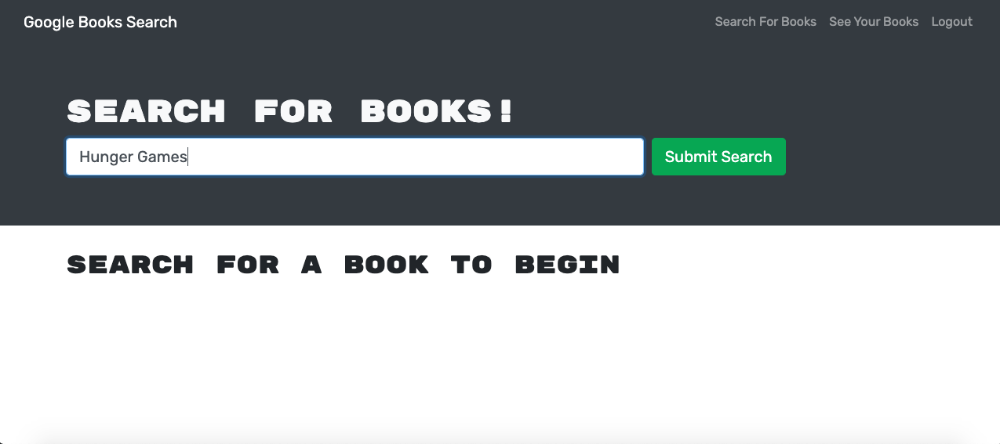
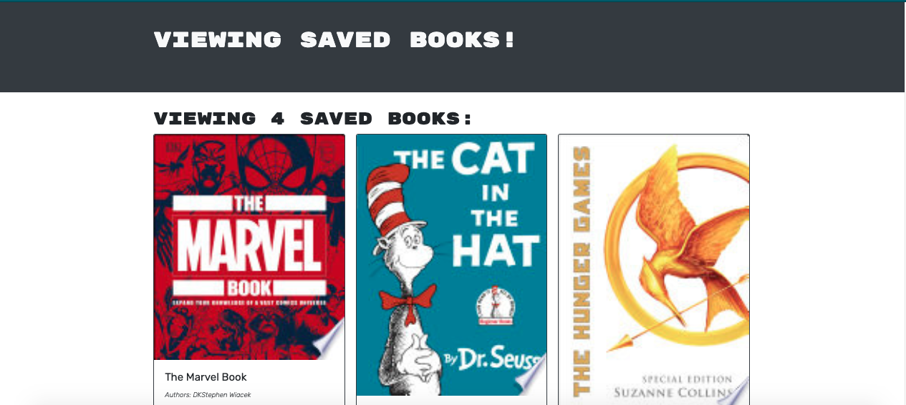

# Book Search Project

[![MIT License][license-shield]][license-url]

<!-- TABLE OF CONTENTS -->

  
Table of Contents

  <ol>
    <li>
      <a href="#about-the-project">About The Project</a>
      <ul>
        <li><a href="#built-with">Built With</a></li>
      </ul>
    </li>
    <li>
      <a href="#getting-started">Getting Started</a>
    </li>
    <li><a href="#usage">Usage</a></li>
    <li><a href="#license">License</a></li>
    <li><a href="#contact">Contact</a></li>
    <li><a href="#acknowledgements">Acknowledgements</a></li>
  </ol>

<!-- ABOUT THE PROJECT -->
## About The Project

This is a MERN stack application that allows you to search for any book by using the google books api The application allows for searching books with out logging in, however, if you wish to create a reading list and save the books, this application allows for users to sign up and save books to their profile.

Once signed up you may save books from your list and also you may delete books from your profile. 

### Built With
- React
- MongoDB
- Express.js
- Node.js
- Apollo
- GraphQL

<!-- GETTING STARTED -->
## Getting Started

1. Fork the Code
2. Create your own branch by writing `npm checkout -b feature/my-branch`

### Installation

Once forked and on your own branch navigate to the root of the project and type `npm i` to install all of the dependencies then run `npm start` to run the application on your machine

<!-- USAGE EXAMPLES -->
## Usage

> When you enter into the website you will first see this

>this is a view of your profile and saved books

[Link to Deployed Application](https://infinite-ridge-00296.herokuapp.com/)

<!-- LICENSE -->
## License

Distributed under the MIT License. See `LICENSE` for more information.

<!-- CONTACT -->
## Contact

Bryce Drawe - [@bdrawe10](https://twitter.com/bdrawe10) 

Project Link: [https://github.com/bdrawe/book-search](https://github.com/bdrawe/book-search)

[license-shield]: https://img.shields.io/github/license/othneildrew/Best-README-Template.svg?style=for-the-badge
[license-url]: https://github.com/othneildrew/Best-README-Template/blob/master/LICENSE.txt

